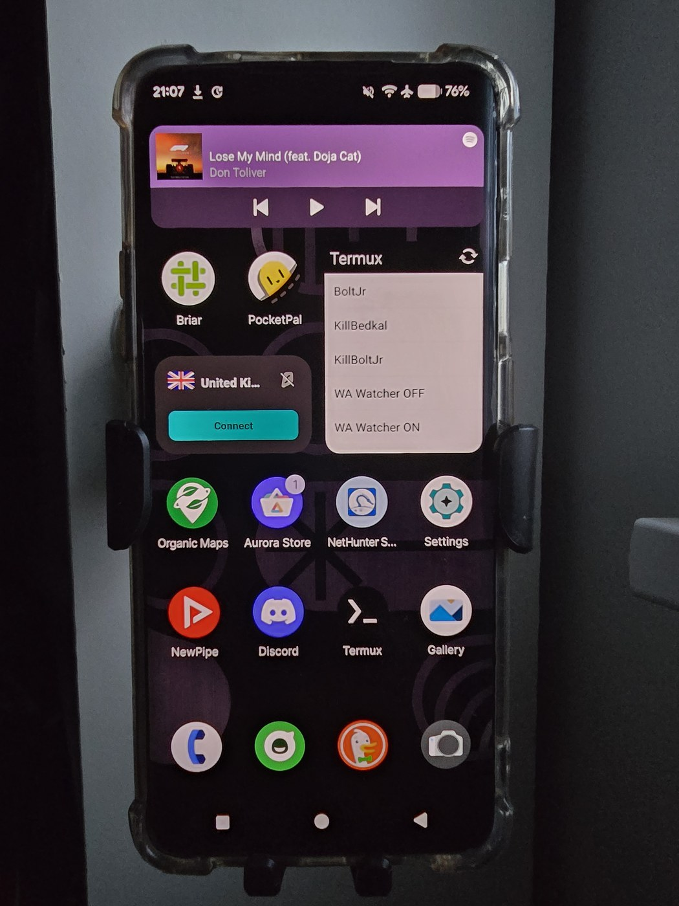

# 07 · Optional: A Standalone AI Agent in Termux

> **Fully optional.** This is the "bonus" layer: an always‑on personal AI agent that
> lives **on the phone itself** (not tethered to a laptop), reachable remotely, with a
> local LLM fallback when there's no internet.

The build this repo documents ran [OpenClaw](https://github.com/openclaw/openclaw)
inside **Termux**, with a "smart startup" script that detects connectivity and picks
an online cloud model or an offline on‑device model automatically.

<p align="center">
  
  <br>
  <em>The Termux:Widget (bottom‑left) exposes one‑tap launch/kill scripts for the agent — the smart‑startup pattern below. PocketPal (top‑left) is a handy on‑device LLM app for offline chat.</em>
</p>

> Nothing here is specific to one assistant — the *pattern* (Termux + Node + a startup
> script + online/offline switching) works for any agent runtime.

## 1. Install Termux (the right one)

Install **Termux from [F‑Droid](https://f-droid.org/en/packages/com.termux/)** or
GitHub — **not** the abandoned Play Store build. Then:

```bash
pkg update && pkg upgrade
pkg install nodejs git python tmux termux-api
```

Install **Termux:Widget** and **Termux:API** as well (from F‑Droid) — the widget gives
you a home‑screen tap‑to‑launch button.

## 2. Install the agent runtime

```bash
npm install -g openclaw       # or your runtime of choice
```

Configure it with your model provider credentials and (optionally) a chat channel
(Discord/Telegram/etc.) so you can reach it remotely.

> **Secrets:** put tokens in a file the agent reads (e.g. an `.env`), and **never**
> commit them. Keep the phone's storage encrypted.

## 3. Optional: on‑device LLM for offline mode

Build/install [`llama.cpp`](https://github.com/ggml-org/llama.cpp) in Termux and drop a
small quantized GGUF model (e.g. a 3B‑class instruct model) on the device. Run it as a
local OpenAI‑compatible server:

```bash
llama-server -m ~/models/your-3b-model.gguf --port 8080 --host 127.0.0.1
```

> **Path gotcha:** when llama.cpp is built under Termux, the server binary may live at
> `/data/user/0/com.termux/llama.cpp/build/bin/llama-server`, **not** `$HOME/llama.cpp/...`.
> Point your scripts at the real path.

## 4. The "smart startup" pattern

The goal: one home‑screen button that:

1. Kills any stale processes / lockfiles.
2. Detects internet.
3. **Online** → rewrites config to use a cloud model (with a fallback chain) + enables
   remote chat.
4. **Offline** → starts the local llama server and points the agent at it, disables
   remote chat (so it doesn't crash on DNS failures).
5. Launches everything under `tmux` so it survives you closing Termux.

Reference scripts (sanitized) are in [`../scripts/`](../scripts/):

- [`agent-smart-startup.sh`](../scripts/agent-smart-startup.sh) — the main launcher
- [`update-config.py`](../scripts/update-config.py) — rewrites the agent config for
  online vs offline
- [`gw-start.sh`](../scripts/gw-start.sh) — starts the agent process with env vars

### Hard‑won lessons (so you don't repeat them)

- **Lockfiles persist after a force‑kill.** If the runtime keeps its own lock (e.g.
  `/tmp/<runtime>-*/.lock`), `rm -f` it *and* `killall -9` the process in your startup
  script, or restarts silently fail.
- **`tmux new-session` + complex inline commands/heredocs = escaping hell.** Put the
  logic in **separate script files** and call them; don't cram multi‑line shell into a
  single `tmux new-session '...'`.
- **Connectivity is only checked at launch.** If you toggle Wi‑Fi, re‑tap the button —
  the script doesn't watch the network continuously (keep it simple).
- **Keep the phone plugged in.** For a 24/7 agent, disable battery optimization for
  Termux and acquire a wakelock (`termux-wake-lock`).

## 5. Keep it alive

```bash
termux-wake-lock                 # prevent doze from killing it
# add termux-wake-lock + your startup script to ~/.termux/boot/ (Termux:Boot)
```

Install **Termux:Boot** (F‑Droid) and put a launcher script in `~/.termux/boot/` so the
agent comes back after a reboot.

---

That's the whole stack: a de‑Googled, rooted, pentest‑capable OnePlus 7T Pro that can
also *think* on its own. Have fun — responsibly.
